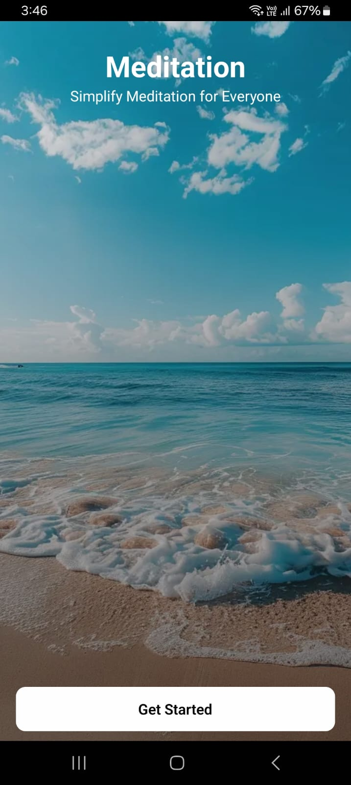
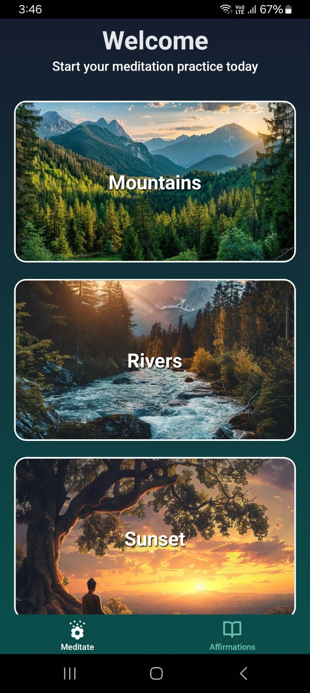
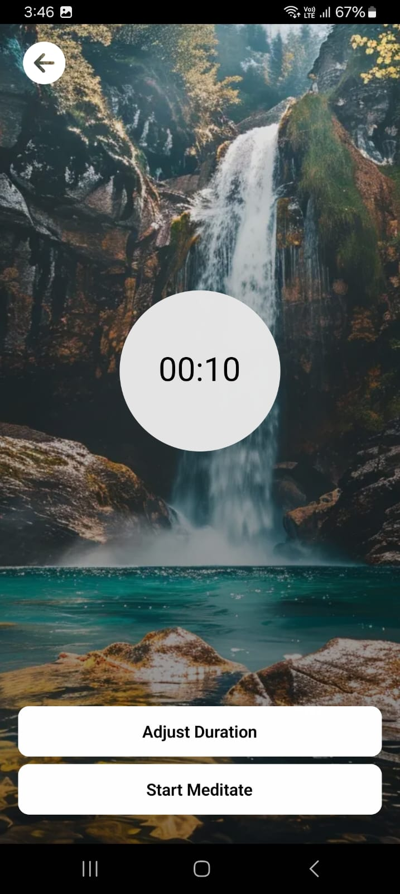
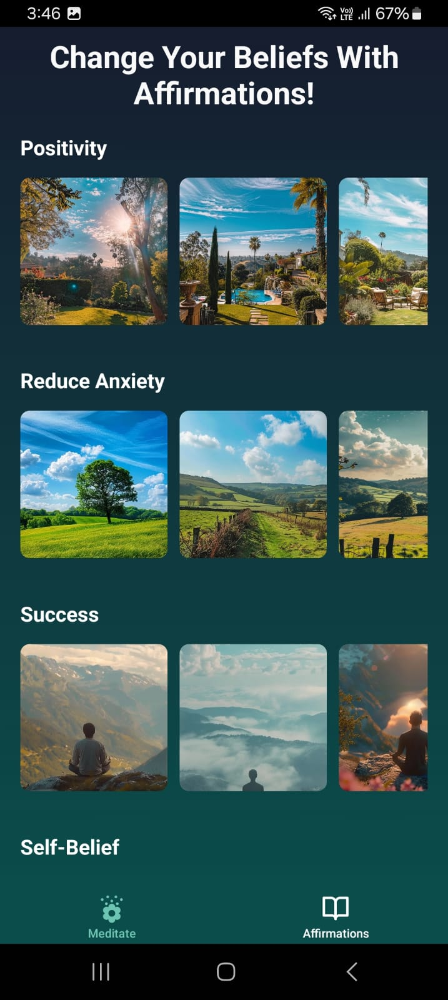
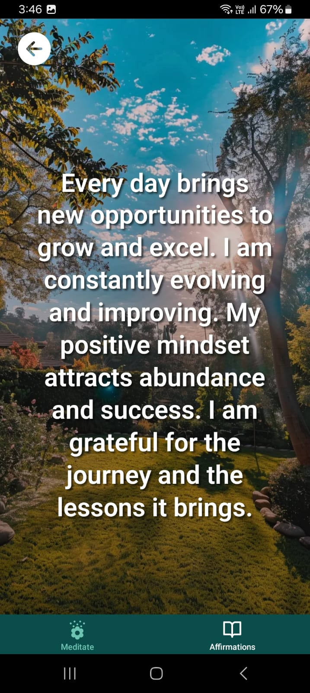

# 🧘‍♂️ Meditation App 🧘‍♀️

Welcome to the Meditation App! ✨ This app is designed to help you find peace and mindfulness with guided meditation sessions, calming sounds, and more. Whether you're a beginner or an experienced meditator, this app will guide you to a better state of mind. 🌿

📦 **Download the APK** 📥: [Download APK](https://expo.dev/accounts/5ujay/projects/Meditation/builds/4e302ea2-cfee-474d-8879-82dcf2771500)

## Features 🚀
- 🧘‍♂️ Guided Meditation Sessions
- 🎶 Calming Soundscapes (Rain, Ocean Waves, Forest Sounds, etc.)
- ⏱️ Meditation Timers
- 🛏️ Sleep Aid Features

## Screenshots 📱

<div style="display: flex; flex-wrap: wrap; justify-content: space-between; gap: 20px;">
  
  
  
  
  
</div>

## Tech Stack 💻

- 🛠️ **Expo**: The framework for building the app.
- ⚛️ **React Native**: For building native mobile applications.
- 🌐 **Expo Router**: For routing and navigation.
- 🧩 **NativeWind**: Utility-first CSS for styling with Tailwind.
- 📱 **React Navigation**: For app navigation.
- 🛠️ **React Context**: For efficient data fetching.

## Installation ⚙️

To get started, clone the repo and install the dependencies:

```bash
git clone https://github.com/5ujay/Meditation.git
cd meditation
npm install
npx expo start
